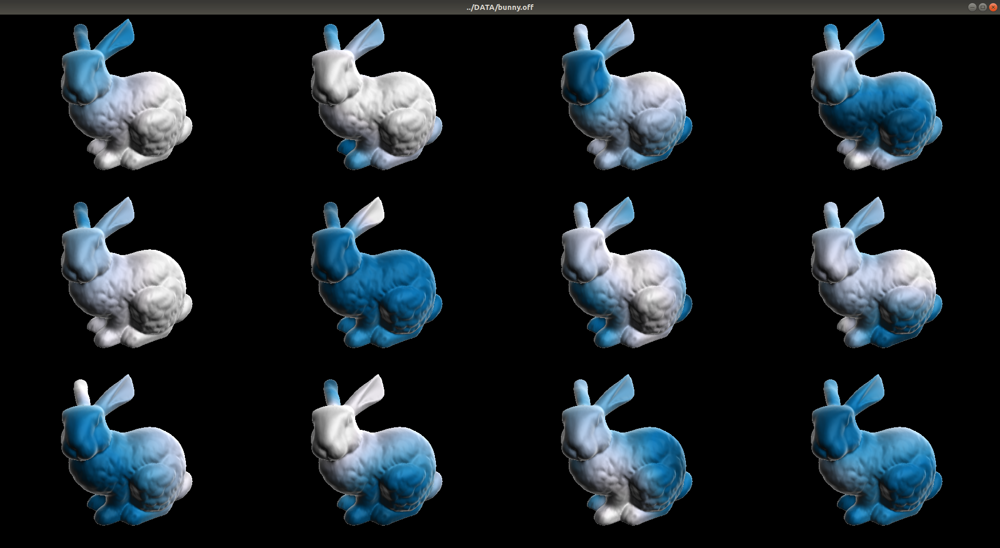

# gproshan
### geometry processing and shape analysis framework

 


## Description
This framework include some algorithms of geometry processing and shape analysis as part of our
graduate research.

## Build and Run
Install all dependencies and run:

	make

finally execute:

	./gproshan [input mesh paths]

### Dependencies (linux)
g++ 7.2, cuda >= 9.1, libarmadillo, libeigen, libsuitesparse, libopenblas, opengl, gnuplot, libcgal

## Contributions

### CHE implementation
We have implemented a [Compact Half-Edge (CHE)](http://citeseerx.ist.psu.edu/viewdoc/summary?doi=10.1.1.523.7580) data structure to manipulated the meshes. (See the paper: [CHE: A scalable topological data structure for triangular meshes](http://citeseerx.ist.psu.edu/viewdoc/summary?doi=10.1.1.523.7580))

### Geodesics
We proposed a CPU/GPU parallel algorithm to compute geodesics distances on triangular meshes. Our
approach is competitive with the current methods and is simple of implement. Please cite our paper:

[An Iterative Parallel Algorithm for Computing Geodesic Distances on Triangular Meshes]()

```bibtex
@article{ptp2018,
	author	= { Luciano A. Romero Calla and Lizeth J. Fuentes Perez and Anselmo A. Montenegro and Marcos Lage },
	title	= { An Iterative Parallel Algorithm for Computing Geodesic Distances on Triangular Meshes },
	year	= {2018},
	url		= { }
}
```

Also, we have implemented the [Fast Marching algorithm](), and the [Heat method](https://www.cs.cmu.edu/~kmcrane/Projects/HeatMethod/index.html).

### Dictionary Learning
We proposed a Dictionary Learning and Sparse Coding framework in order to solve the problems of Denoising, Inpainting and Multiresolution on triangular meshes. Please see an cite our work:

[A Dictionary Learning-based framework on Triangular Meshes]()

```bibtex
@article{dlspf2018,
	author	= { Luciano A. Romero Calla and Lizeth J. Fuentes Perez and Anselmo A. Montenegro },
	title	= { A Dictionary Learning-based framework on Triangular Meshes },
	year	= { 2018 },
	url		= { }
}
```

### Hole repairing
We implemented repairing mesh holes in two steps:

1. Generate a mesh to cover the hole (modified algorithm base on ...).
2. Approximate the curvature solving the Poisson equation and using Biharmonic splines.

### Decimation
We are implementing the algorithm ?? to decimate a mesh. 

### Fairing
Spectral and Taubin algorithms.

### Laplacian and signatures
Laplace-Beltrami operator and its eigen decomposition, WKS, HKS, GPS signatures.

## Documentation
Execute:

	doxygen Doxyfile

to generate the documentation in html and latex.

## Viewer
The viewer was initially based in the viewer of [https://github.com/dgpdec/course](https://github.com/dgpdec/course). The current viewer use VAO and VBO to render, and the shaders have been modified and upgraded.

## Authors
- Lizeth Joseline Fuentes Pérez
- Luciano Arnaldo Romero Calla

